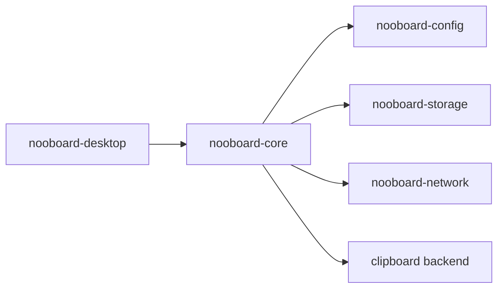

# nooboard-core Specification

This document is the authoritative implementation contract for the future `crates/nooboard-core`
crate.

If implementation code conflicts with this document, the implementation is wrong. Any intentional
behavior change must update this document first.

## 1. Goals

`nooboard-core` is the application domain runtime for nooboard.

It is responsible for:

- bootstrap resolution and workspace launch orchestration
- coordinating `nooboard-config`, `nooboard-storage`, `nooboard-network`, and the local clipboard
- owning the in-memory workspace state presented to the desktop frontend
- persisting user configuration changes to `nooboard.toml`
- applying clipboard, storage, and network side effects in the correct order
- exposing a frontend-safe Rust API for the desktop application

It is not responsible for:

- implementing the config file schema
- implementing network transport, session protocol, LAN discovery, or direct connect
- implementing SQLite repositories or SQL schema
- rendering UI
- maintaining compatibility with `nooboard-app` or `nooboard-sync`

The target architecture is:



After `nooboard-core` is complete and the desktop app is migrated, `crates/nooboard-app` and
`crates/nooboard-sync` are deleted.

## 2. Non-Negotiable Boundaries

The implementation MUST obey these boundaries:

- `nooboard-core` MUST depend on `nooboard-config`, `nooboard-storage`, `nooboard-network`, and
  platform clipboard abstractions.
- `nooboard-core` MUST NOT depend on `nooboard-desktop`.
- `nooboard-core` MUST NOT define its own storage schema or persistence engine.
- `nooboard-core` MUST NOT define its own transport protocol or peer discovery logic.
- `nooboard-core` MUST NOT expose any `nooboard-sync`-era vocabulary such as `SyncRuntime`,
  `PeerTransport`, `manual_peers`, `mdns_enabled`, or `SettingsPatch`.
- `nooboard-core` MUST treat bootstrap chooser flow as normal control flow, not as an error.
- `nooboard-core` MUST own config persistence. `nooboard-network` MUST remain pure in-memory.
- `nooboard-core` MUST expose a standalone Rust API that the desktop crate can use directly.

### 2.1 Module-level cohesion rules

The implementation MUST obey these internal structure rules:

- `runtime.rs` MUST contain only the public `NooboardCore` facade, construction, and method
  delegation.
- `runtime.rs` MUST NOT contain clipboard commit logic.
- `runtime.rs` MUST NOT contain config mutation logic.
- `runtime.rs` MUST NOT contain storage query logic.
- `runtime.rs` MUST NOT contain transfer mutation logic.
- `runtime.rs` MUST NOT contain direct seed CRUD logic.
- `bootstrap.rs` MUST only wrap and re-export bootstrap behavior from `nooboard-config`.
- `workspace/actor.rs` MUST only route commands and background messages; domain logic MUST live in
  dedicated handler modules.
- `workspace/state.rs` MUST assemble snapshots and own mutable workspace state, but MUST NOT do
  I/O directly.
- `workspace/handlers/config.rs` MUST own config mutation, validation, save, and runtime
  reconfiguration flow.
- `workspace/handlers/clipboard.rs` MUST own clipboard-to-storage and storage-to-clipboard flows.
- `workspace/handlers/network.rs` MUST own network command forwarding and network event
  interpretation.
- `workspace/handlers/transfers.rs` MUST own file transfer command forwarding.
- `workspace/bridges/*.rs` MUST only forward background subscription updates into actor messages.
- Public DTOs MUST live in `types/` modules and MUST NOT depend on private workspace state.

If an implementation change causes `runtime.rs` or `workspace/actor.rs` to become mixed
facade/store/domain-logic files, that implementation is non-conformant.

### 2.2 State ownership rules

Unlike `nooboard-network`, `nooboard-core` is allowed to keep a mutable in-memory `AppConfig`
mirror because it owns config persistence.

Allowed:

- `config_path` and current `AppConfig` inside workspace state
- mutable derived workspace state such as `latest_committed_event_id`
- a single owned `StorageRuntime`
- a single owned `ClipboardRuntime`
- a single owned `NetworkRuntime`

Forbidden:

- a second mutable config mirror outside workspace state
- dual-writing the same user setting in multiple in-memory stores
- storing a second long-lived copy of `NetworkConfig` outside the `NetworkRuntime` instance
- deriving UI state in multiple places

### 2.3 Actor ownership rules

`nooboard-core` MUST use a single workspace actor as the only mutable owner of workspace state.

This means:

- every public mutating API call MUST enter the actor
- clipboard watch events MUST be forwarded into the actor
- network events MUST be forwarded into the actor
- the actor MUST be the only place that mutates workspace state

Background tasks MUST NOT mutate shared state directly.

### 2.4 Testability rules

The implementation MUST be testable without mutating private state directly.

This means:

- handler modules MUST have direct unit tests
- snapshot assembly MUST be testable without private state injection through the public facade
- tests MUST NOT reach into `runtime.inner.state`
- tests MUST NOT mutate actor-owned internals behind the facade

## 3. Public Vocabulary

`nooboard-core` exposes workspace-level, not protocol-level, vocabulary.

Publicly meaningful concepts are:

- bootstrap decision and workspace launch
- clipboard history records
- local connection preview
- current settings snapshot
- network snapshot
- direct seeds
- pending direct requests
- active sessions
- file transfers

`nooboard-core` MUST directly re-export the following `nooboard-network` public types:

- `ConnectDirectOutcome`
- `ConnectionFailure`
- `ConnectionFailureKind`
- `DirectRequestId`
- `DirectSeedId`
- `DirectSeedInfo`
- `IncomingTransferDecision`
- `IncomingTransferDisposition`
- `IncomingTransferOffer`
- `LanPeerInfo`
- `NetworkSnapshot`
- `NetworkStatus`
- `PendingDirectRequest`
- `SendFilesRequest`
- `SessionId`
- `SessionInfo`
- `SessionTarget`
- `TransferTicket`
- `TransfersSnapshot`
- `UpsertDirectSeedInput`

`nooboard-core` MUST define its own clipboard history types because they belong to the storage +
clipboard domain rather than the pure network domain.

## 4. Public Bootstrap API

The crate MUST expose bootstrap helpers that preserve the exact behavior defined by
`nooboard-config`.

```rust
pub use nooboard_config::{
    BootstrapChooserContext,
    BootstrapChooserReason,
    BootstrapDecision,
    BootstrapLaunch,
    BootstrapMode,
    BootstrapRequest,
};

pub fn resolve_bootstrap(request: &BootstrapRequest) -> CoreResult<BootstrapDecision>;

pub fn prepare_default_config_from_chooser(
    context: &BootstrapChooserContext,
) -> CoreResult<BootstrapLaunch>;
```

### 4.1 Bootstrap semantics

- `resolve_bootstrap(...)` MUST forward to `nooboard-config` behavior.
- version-mismatched default config MUST route to chooser, not hard failure.
- chooser-triggered default reset MUST archive only the managed default bundle entries currently
  defined by `nooboard-config`: `nooboard.toml`, `noob_id`, and `data`.
- archive directories MUST be named `archive/vN_timestamp/` or `archive/vunknown_timestamp/`.
- `prepare_default_config_from_chooser(...)` MUST remain destructive only when the chooser reason
  authorizes it.
- explicit chooser requests MUST NOT silently recreate the default config.

## 5. Public Runtime API

The crate MUST expose an opaque workspace handle with these methods:

```rust
pub type CoreResult<T> = Result<T, CoreError>;

#[derive(Clone)]
pub struct NooboardCore { /* opaque */ }

impl NooboardCore {
    pub fn launch(
        launch: &BootstrapLaunch,
        clipboard: std::sync::Arc<dyn ClipboardPort>,
    ) -> CoreResult<Self>;

    pub async fn shutdown(&self) -> CoreResult<()>;

    pub async fn snapshot(&self) -> CoreResult<WorkspaceSnapshot>;
    pub async fn subscribe_state(&self) -> CoreResult<StateSubscription>;
    pub async fn subscribe_events(&self) -> CoreResult<EventSubscription>;

    pub async fn start_network(&self) -> CoreResult<()>;
    pub async fn stop_network(&self) -> CoreResult<()>;

    pub async fn set_device_id(&self, value: String) -> CoreResult<()>;
    pub async fn set_network_token(&self, value: String) -> CoreResult<()>;
    pub async fn set_network_listen_port(&self, value: u16) -> CoreResult<()>;
    pub async fn set_lan_enabled(&self, value: bool) -> CoreResult<()>;
    pub async fn set_local_capture_enabled(&self, value: bool) -> CoreResult<()>;
    pub async fn set_download_dir(&self, value: std::path::PathBuf) -> CoreResult<()>;
    pub async fn set_storage_settings(
        &self,
        input: StorageSettingsInput,
    ) -> CoreResult<()>;

    pub async fn list_direct_seeds(&self) -> CoreResult<Vec<DirectSeedInfo>>;
    pub async fn upsert_direct_seed(
        &self,
        input: UpsertDirectSeedInput,
    ) -> CoreResult<DirectSeedId>;
    pub async fn remove_direct_seed(&self, id: DirectSeedId) -> CoreResult<()>;
    pub async fn search_direct_seeds(&self, query: &str) -> CoreResult<Vec<DirectSeedInfo>>;
    pub async fn connect_direct_seed(
        &self,
        id: DirectSeedId,
    ) -> CoreResult<ConnectDirectOutcome>;
    pub async fn list_pending_direct_requests(
        &self,
    ) -> CoreResult<Vec<PendingDirectRequest>>;
    pub async fn approve_direct_request(&self, id: DirectRequestId) -> CoreResult<()>;
    pub async fn reject_direct_request(&self, id: DirectRequestId) -> CoreResult<()>;
    pub async fn list_sessions(&self) -> CoreResult<Vec<SessionInfo>>;
    pub async fn disconnect_session(&self, id: SessionId) -> CoreResult<()>;

    pub async fn submit_text(&self, content: String) -> CoreResult<EventId>;
    pub async fn get_clipboard_record(&self, event_id: EventId) -> CoreResult<ClipboardRecord>;
    pub async fn list_clipboard_history(
        &self,
        request: ListClipboardHistoryRequest,
    ) -> CoreResult<ClipboardHistoryPage>;
    pub async fn adopt_clipboard_record(&self, event_id: EventId) -> CoreResult<()>;
    pub async fn rebroadcast_clipboard_record(
        &self,
        event_id: EventId,
        target: SessionTarget,
    ) -> CoreResult<()>;

    pub async fn send_files(
        &self,
        request: SendFilesRequest,
    ) -> CoreResult<Vec<TransferTicket>>;
    pub async fn decide_incoming_transfer(
        &self,
        decision: IncomingTransferDecision,
    ) -> CoreResult<()>;
    pub async fn cancel_transfer(&self, ticket: TransferTicket) -> CoreResult<()>;
}
```

### 5.1 Runtime method semantics

- `launch(...)` MUST:
  - validate and load the config referenced by `launch`
  - create `StorageRuntime`
  - create `ClipboardRuntime`
  - create a stopped `NetworkRuntime`
  - start clipboard watch only if `local_capture_enabled == true`
  - return a ready workspace handle
- `launch(...)` MUST NOT auto-start the network runtime.
- `start_network()` MUST be idempotent.
- `stop_network()` MUST be idempotent.
- `shutdown()` MUST:
  - stop clipboard watch
  - stop network runtime
  - shut down storage runtime
  - terminate background bridge tasks

## 6. Public Types

The crate MUST define the following public types:

```rust
pub trait ClipboardPort: Send + Sync {
    fn read_text(&self) -> CoreResult<Option<String>>;
    fn write_text(&self, text: &str) -> CoreResult<()>;
    fn watch_changes(
        &self,
        sender: nooboard_platform::ClipboardEventSender,
        shutdown: std::sync::Arc<std::sync::atomic::AtomicBool>,
        interval: std::time::Duration,
    ) -> CoreResult<std::thread::JoinHandle<()>>;
}

pub struct WorkspaceSnapshot {
    pub revision: u64,
    pub identity: WorkspaceIdentity,
    pub local_connection: LocalConnectionInfo,
    pub clipboard: ClipboardState,
    pub settings: WorkspaceSettings,
    pub network: NetworkSnapshot,
}

pub struct WorkspaceIdentity {
    pub noob_id: NoobId,
    pub device_id: String,
}

pub struct LocalConnectionInfo {
    pub device_endpoint: Option<std::net::SocketAddr>,
}

pub struct ClipboardState {
    pub latest_committed_event_id: Option<EventId>,
}

pub struct WorkspaceSettings {
    pub connection: ConnectionSettings,
    pub network: NetworkSettings,
    pub storage: StorageSettings,
    pub clipboard: ClipboardSettings,
    pub transfers: TransferSettings,
}

pub struct ConnectionSettings {
    pub device_id: String,
    pub token: String,
}

pub struct NetworkSettings {
    pub listen_port: u16,
    pub lan_enabled: bool,
}

pub struct StorageSettings {
    pub db_root: std::path::PathBuf,
    pub history_window_days: u32,
    pub dedup_window_days: u32,
    pub max_text_bytes: usize,
    pub gc_batch_size: usize,
}

pub struct StorageSettingsInput {
    pub history_window_days: u32,
    pub dedup_window_days: u32,
    pub max_text_bytes: usize,
    pub gc_batch_size: usize,
}

pub struct ClipboardSettings {
    pub local_capture_enabled: bool,
}

pub struct TransferSettings {
    pub download_dir: std::path::PathBuf,
}

pub struct ClipboardRecord {
    pub event_id: EventId,
    pub source: ClipboardRecordSource,
    pub origin_noob_id: NoobId,
    pub origin_device_id: String,
    pub created_at_ms: i64,
    pub applied_at_ms: i64,
    pub content: String,
}

pub enum ClipboardRecordSource {
    LocalCapture,
    RemoteSync,
    UserSubmit,
}

pub struct ListClipboardHistoryRequest {
    pub limit: usize,
    pub cursor: Option<ClipboardHistoryCursor>,
}

pub struct ClipboardHistoryPage {
    pub records: Vec<ClipboardRecord>,
    pub next_cursor: Option<ClipboardHistoryCursor>,
}

pub struct ClipboardHistoryCursor {
    pub created_at_ms: i64,
    pub event_id: EventId,
}

pub struct EventId(/* opaque uuid newtype */);
pub struct NoobId(/* opaque string newtype */);

pub enum WorkspaceEvent {
    ClipboardCommitted {
        event_id: EventId,
        source: ClipboardRecordSource,
    },
    IncomingTransferOffered {
        ticket: TransferTicket,
    },
    TransferUpdated {
        ticket: TransferTicket,
    },
    TransferCompleted {
        ticket: TransferTicket,
        outcome: nooboard_network::TransferOutcome,
    },
    NetworkConnectionFailed {
        failure: ConnectionFailure,
    },
}
```

### 6.1 Snapshot semantics

- `WorkspaceSnapshot.network` MUST be copied directly from `NetworkRuntime::snapshot()`.
- `WorkspaceSnapshot` MUST NOT maintain a second peer list or second transfer list outside
  `NetworkSnapshot`.
- `WorkspaceSnapshot.settings.network` MUST contain only persisted settings, not transient network
  state.
- `WorkspaceSnapshot.revision` MUST increase only when the snapshot changes.

## 7. Clipboard, Storage, and Network Behavior

### 7.1 Local clipboard observation

When local clipboard watch is enabled and a new clipboard text event is observed:

1. generate a new `EventId`
2. validate text size against storage limits
3. append the record to storage with source `LocalCapture`
4. update `latest_committed_event_id`
5. publish `WorkspaceEvent::ClipboardCommitted`
6. if the network runtime is running, send the text to `SessionTarget::AllConnected`

The storage commit happens before network broadcast. Storage success is never rolled back.

### 7.2 Remote text reception

When the network runtime reports an incoming text event:

1. parse the incoming `event_id`
2. append the record to storage with source `RemoteSync`
3. if append returns "already exists", treat the event as deduplicated and do not emit a second
   clipboard commit event
4. if append succeeds, update `latest_committed_event_id`
5. publish `WorkspaceEvent::ClipboardCommitted`

Remote text reception MUST NOT overwrite the local system clipboard automatically.

### 7.3 User-submitted text

`submit_text(content)` behaves like a local clipboard-originated text commit except that it MUST
NOT write to the local system clipboard.

If network broadcast fails after storage commit, the method returns an error and the locally stored
record remains persisted.

### 7.4 Clipboard adoption

`adopt_clipboard_record(event_id)` MUST:

- load the record from storage
- write its content to the system clipboard
- register suppression in the clipboard runtime so the self-authored write does not immediately
  re-enter as a duplicate local capture event
- NOT broadcast to the network

### 7.5 Clipboard rebroadcast

`rebroadcast_clipboard_record(event_id, target)` MUST:

- load the record from storage
- send the stored content to the requested `SessionTarget`
- NOT mutate storage
- NOT write the local clipboard

## 8. File Transfer Behavior

- `send_files(...)` MUST delegate directly to `NetworkRuntime::send_files(...)`.
- `decide_incoming_transfer(...)` MUST delegate directly to `NetworkRuntime`.
- `cancel_transfer(...)` MUST delegate directly to `NetworkRuntime`.
- `WorkspaceSnapshot.network.transfers` is the single source of truth for transfer state.
- incoming transfer offers, active transfer updates, and transfer completions MUST be surfaced as
  `WorkspaceEvent`s with the corresponding `TransferTicket`.

`nooboard-core` MUST NOT maintain a second transfer state machine parallel to
`nooboard-network`.

## 9. Configuration Mutation Semantics

Every config-mutating public method MUST follow this order:

1. clone current `AppConfig`
2. apply the requested mutation to the clone
3. validate the resulting config and any derived runtime config
4. save the new config atomically to disk
5. replace in-memory config
6. apply runtime side effects
7. refresh workspace snapshot

There is no rollback after step 4. The saved config is the source of truth.

If a runtime side effect fails after config save, the method MUST return an error and leave the
persisted config intact.

### 9.1 Mutable configuration surface

The public mutable surface is exactly:

- `device_id`
- `network.auth.token`
- `network.listen_port`
- `network.lan.enabled`
- `app.clipboard.local_capture_enabled`
- `network.transfer.download_dir`
- `storage.lifecycle.history_window_days`
- `storage.lifecycle.dedup_window_days`
- `storage.max_text_bytes`
- `storage.lifecycle.gc_batch_size`
- `network.direct.seeds`

No generic settings patch API is allowed.

### 9.2 Runtime reconfiguration rules

- changing `lan.enabled` MUST hot-update `NetworkRuntime`
- changing `direct.seeds` MUST hot-update `NetworkRuntime`
- changing `device_id`, `network.auth.token`, or `network.listen_port` MUST rebuild and restart
  `NetworkRuntime` if it is currently running
- changing `download_dir` MUST rebuild `NetworkRuntime` if it is currently running
- changing storage settings MUST reconfigure `StorageRuntime`
- changing `local_capture_enabled` MUST start or stop clipboard watch without touching the network

## 10. Background Bridges

`nooboard-core` MUST run background bridge tasks for:

- local clipboard subscription
- network event subscription

Those bridge tasks MUST only forward messages into the actor command channel.

Storage runtime interaction remains request/response only and MUST NOT require a storage
subscription bridge.

## 11. Error Model

The crate MUST expose:

```rust
pub enum CoreError {
    Config(nooboard_config::ConfigError),
    Storage(nooboard_storage::StorageError),
    Network(nooboard_network::NetworkError),
    Clipboard(String),
    ChannelClosed(String),
    InvalidState(String),
    EventNotFound { event_id: String },
    SessionNotFound { session_id: String },
    TransferNotFound { ticket: String },
    TransferNotCancelable { ticket: String },
    TextTooLarge { actual_bytes: usize, max_bytes: usize },
}
```

The exact payload type for clipboard failures may be refined, but clipboard/backend failures MUST
remain distinguishable from config, storage, and network failures.

## 12. Internal Module Layout

The implementation MUST use this top-level structure or a directly equivalent one:

```text
crates/nooboard-core/
  src/lib.rs
  src/error.rs
  src/bootstrap.rs
  src/runtime.rs

  src/types/
    mod.rs
    clipboard.rs
    events.rs
    settings.rs
    snapshot.rs

  src/clipboard/
    mod.rs
    port.rs
    runtime.rs

  src/storage/
    mod.rs
    runtime.rs

  src/workspace/
    mod.rs
    actor.rs
    command.rs
    state.rs
    subscriptions.rs

    handlers/
      clipboard.rs
      config.rs
      network.rs
      storage.rs
      transfers.rs

    bridges/
      clipboard.rs
      network.rs
```

Equivalent layouts are allowed only if all cohesion rules in this document still hold.

## 13. Migration Target

This crate is the replacement for `nooboard-app`.

Once `nooboard-desktop` is migrated to `nooboard-core`:

- `crates/nooboard-app` is deleted
- `crates/nooboard-sync` is deleted
- `crates/nooboard-desktop` depends on `nooboard-core` directly

There is no compatibility mode.
