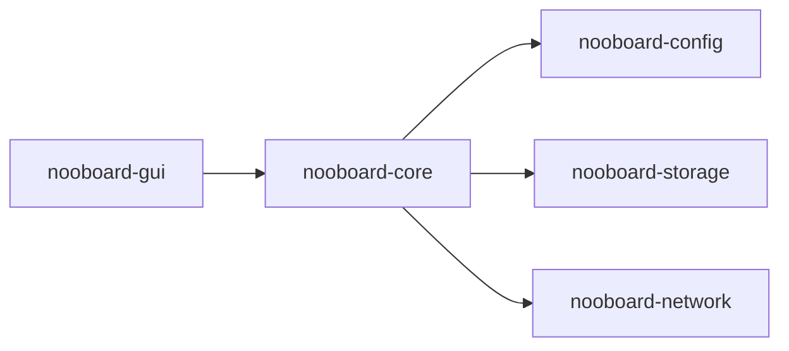

# nooboard-gui Specification

This document is the authoritative implementation contract for the future
`crates/nooboard-gui` crate.

If implementation code conflicts with this document, the implementation is wrong. Any intentional
behavior change must update this document first.

## 1. Goals

`nooboard-gui` is the GPUI frontend for nooboard.

It is responsible for:

- rendering the bootstrap and workspace interfaces
- integrating directly with `nooboard-core`
- translating `WorkspaceSnapshot` and `WorkspaceEvent` into UI-visible state
- preserving the visual language of the current `nooboard-desktop` application
- preserving the existing responsive layout behavior of the current desktop application

It is not responsible for:

- implementing configuration schema or bootstrap policy
- implementing storage or clipboard persistence
- implementing network transport, LAN discovery, direct connect, or transfer protocol
- defining a second business-state model separate from `nooboard-core`
- maintaining compatibility with `nooboard-desktop`, `nooboard-app`, or `nooboard-sync`

The target architecture is:



After `nooboard-gui` is complete and adopted, `crates/nooboard-desktop`, `crates/nooboard-app`,
and `crates/nooboard-sync` are deleted.

## 2. Non-Negotiable Boundaries

The implementation MUST obey these boundaries:

- `nooboard-gui` MUST depend directly on `nooboard-core`.
- `nooboard-gui` MUST NOT depend on `nooboard-app`.
- `nooboard-gui` MUST NOT depend on `nooboard-sync`.
- `nooboard-gui` MUST NOT define or use `DesktopAppService`.
- `nooboard-gui` MUST NOT define or use `SyncRuntime`, `SyncActualStatus`, `PeerTransport`,
  `manual_peers`, or any other `nooboard-sync`-era vocabulary.
- `nooboard-gui` MUST treat `WorkspaceSnapshot` as the only business-state source of truth.
- `nooboard-gui` MUST treat `WorkspaceEvent` as ephemeral notification input, not as durable state.
- `nooboard-gui` MUST use `NooboardCore` commands directly for all workspace mutations.
- `nooboard-gui` MUST NOT add a compatibility adapter between the old desktop service model and
  `nooboard-core`.

### 2.1 Visual fidelity rules

The rewrite MUST preserve the existing visual identity of `nooboard-desktop`.

This means:

- the default expectation is that shell layout, typography, spacing, accent usage, and overall page
  composition remain visually consistent with the current desktop application
- the default expectation is that responsive behavior remains consistent with the current desktop
  application, including panel collapse, content stacking, sidebar behavior, and density changes
- existing UI components MAY be visually ported or copied from `nooboard-desktop` if they do not
  drag old state-management code with them
- rework is allowed only where the old component no longer matches `nooboard-core` vocabulary or
  workflows
- when a component must change to match the new core model, the new component MUST preserve the
  same visual language unless there is a strong product reason not to

The rewrite is NOT an opportunity for a visual redesign.

### 2.2 Module-level cohesion rules

The implementation MUST obey these internal structure rules:

- `app.rs` MUST only assemble the top-level GPUI application and route to bootstrap or workspace
  flows.
- `assets.rs` SHOULD own bundled asset manifests and GPUI asset-source wiring.
- `bootstrap/*` MUST only own bootstrap UI state, bootstrap commands, and bootstrap-to-core launch
  flow.
- `bootstrap/state.rs` SHOULD own chooser-local selection state and preset-specific probe results.
- `workspace/core_bridge.rs` MUST only hold `NooboardCore`, subscriptions, and bridge lifecycle.
- `workspace/controller.rs` MUST only coordinate GUI-level actions and UI tasks.
- `workspace/runtime_state.rs` SHOULD own GUI-local load/bridge status types.
- `workspace/recent_activity.rs` SHOULD own recent-activity models and event/status-to-activity
  translation.
- `workspace/view_state/*` MUST only derive UI projection state from `WorkspaceSnapshot`, and
  SHOULD be split by route/domain before one file accumulates unrelated page projections.
- `workspace/shell_view_state.rs` SHOULD only compose shell/header/status projection from GUI-local
  runtime state plus snapshot-derived view state.
- `workspace/subscriptions.rs` MUST only forward state and event subscriptions into GUI updates.
- `workspace/route.rs` SHOULD hold route navigation types only.
- `workspace/actions/*` MUST only define GUI actions and command entry points, and SHOULD be split
  by mutable domain before they become a mixed command hub.
- UI component modules under `ui/` MUST NOT call `NooboardCore` directly.
- UI component modules under `ui/` MUST NOT own business-state mutation logic.

Forbidden structures:

- a large `live_app.rs`-style file that mixes state, subscriptions, commands, and UI glue
- a large `live_commands.rs`-style file that becomes a second app service
- embedding command execution logic directly inside visual component render methods
- a monolithic `controller.rs` that becomes a mixed facade/store/domain-logic file

### 2.3 State ownership rules

`WorkspaceSnapshot` is the only source of truth for business state.

Allowed GUI-local state:

- currently selected tab or route
- search/filter query strings
- currently selected clipboard record
- currently selected direct seed
- currently selected session
- dialog visibility and dialog-local draft values
- toast/notice queue
- file picker state

Forbidden GUI-local state:

- a second copy of active sessions
- a second copy of network status
- a second copy of transfer state
- a second copy of clipboard history
- a second copy of settings values
- any long-lived business-state cache that can diverge from `WorkspaceSnapshot`

### 2.4 Testability rules

The implementation MUST be testable without mutating private GUI internals directly.

This means:

- view-state derivation MUST be testable from `WorkspaceSnapshot` inputs alone
- bridge modules MUST be testable with mock `NooboardCore` handles or test subscriptions
- tests MUST NOT reach into private entity internals just to synthesize app state
- tests MUST prefer action-level and view-state-level coverage over brittle render snapshots

## 3. Public Vocabulary

`nooboard-gui` uses `nooboard-core` and `nooboard-network` vocabulary directly wherever possible.

It MUST directly use:

- `NooboardCore`
- `WorkspaceSnapshot`
- `WorkspaceEvent`
- `ClipboardRecord`
- `ClipboardHistoryPage`
- `EventId`
- `NetworkSnapshot`
- `NetworkStatus`
- `LanPeerInfo`
- `DirectSeedInfo`
- `DirectSeedId`
- `PendingDirectRequest`
- `DirectRequestId`
- `SessionInfo`
- `SessionId`
- `TransferTicket`
- `TransfersSnapshot`

It MUST NOT reintroduce old desktop-facing vocabulary such as:

- `AppState`
- `AppEvent`
- `ConnectedPeer`
- `PeersState`
- `PeerTransport`
- `NetworkSettingsPatch`
- `SettingsPatch`

`nooboard-gui` MAY define its own view-only projection types, but those types MUST be clearly UI
projection types rather than business-domain types.

## 4. Public GUI Crate Shape

The crate SHOULD be structured like this:

```text
crates/nooboard-gui/
  build.rs
  src/main.rs
  src/assets.rs
  src/app.rs

  src/bootstrap/
    mod.rs
    controller.rs
    state.rs
    view_state.rs

  src/workspace/
    mod.rs
    core_bridge.rs
    controller.rs
    runtime_state.rs
    recent_activity.rs
    shell_view_state.rs
    route.rs
    view_state/
      mod.rs
      home.rs
      clipboard.rs
      network.rs
      transfers.rs
      settings.rs
      shared.rs
    subscriptions.rs
    actions/
      mod.rs
      clipboard.rs
      network.rs
      settings.rs
      transfers.rs
      spawn.rs

  src/ui/
    bootstrap/
      actions.rs
      components.rs
      view.rs
    workspace/
      mod.rs
      shell.rs
      home.rs
      clipboard/
        mod.rs
        actions/
          mod.rs
          lifecycle.rs
          history.rs
          editing.rs
          broadcast.rs
        state/
          mod.rs
          history.rs
          editor.rs
          targets.rs
        components.rs
        view_state.rs
        header.rs
        history.rs
        detail.rs
      network.rs
      transfers.rs
      settings.rs
      shared.rs
```

This structure is normative in intent:

- bootstrap flow is separate from workspace flow
- bridge logic is separate from view-state derivation
- UI components are separate from command execution
- logic-layer modules MAY expand into submodule directories when that is required to keep
  route/domain responsibilities separated
- route-level workspace visuals are split into shell/home/clipboard/network/transfers/settings/shared
  modules rather than collected in one render file
- when a route grows beyond a single cohesive file, `ui/workspace/<route>/` MAY expand into a
  submodule directory as long as route-local state, route-local view-state composition, and route
  visuals stay contained within that route module boundary

## 5. Bootstrap Flow

Bootstrap is normal control flow.

The GUI MUST:

1. call `NooboardCore::resolve_bootstrap(...)`
2. branch on `BootstrapDecision`
3. show chooser UI when chooser is required
4. call `NooboardCore::prepare_default_config_from_chooser(...)` when the user chooses to reset the
   default config from the chooser
5. call `NooboardCore::launch(...)` only after a `BootstrapLaunch` exists

The GUI MUST NOT:

- treat chooser-required bootstrap as a fatal error
- reproduce archive/reset logic locally
- directly inspect or manipulate config files during bootstrap

## 6. Workspace Integration Rules

### 6.1 Launch and subscriptions

After launch, the GUI MUST:

1. create a `NooboardCore` handle
2. read the initial `WorkspaceSnapshot`
3. create state and event subscriptions
4. derive the initial UI view state from the snapshot
5. keep the view state synchronized from subsequent snapshot updates

The GUI MUST NOT:

- reconstruct initial state by calling many individual core methods instead of reading the snapshot
- treat event ordering as a replacement for snapshot truth

### 6.2 Snapshot vs event rules

The GUI MUST interpret core outputs this way:

- `WorkspaceSnapshot` is current truth
- `WorkspaceEvent` is transient notification

Implications:

- list views MUST be rendered from snapshot data, not from event accumulation
- toast banners, notices, and one-shot dialogs MAY be triggered from events
- if an event conflicts with the current snapshot, the snapshot wins

### 6.3 Command routing rules

All user actions that mutate application state MUST call `NooboardCore` directly through the GUI
controller/bridge layer.

Permitted calls include:

- `start_network`
- `stop_network`
- `set_device_id`
- `set_network_token`
- `set_network_listen_port`
- `set_lan_enabled`
- `set_local_capture_enabled`
- `set_download_dir`
- `set_storage_settings`
- `upsert_direct_seed`
- `remove_direct_seed`
- `connect_direct_seed`
- `approve_direct_request`
- `reject_direct_request`
- `disconnect_session`
- `submit_text`
- `list_clipboard_history`
- `get_clipboard_record`
- `adopt_clipboard_record`
- `rebroadcast_clipboard_record`
- `send_files`
- `decide_incoming_transfer`
- `cancel_transfer`

UI components MUST NOT call these methods directly from render logic; they MUST route through GUI
actions/controllers.

## 7. Visual Porting Rules

`nooboard-gui` is allowed to port visual components from `nooboard-desktop`, but only under these
rules:

- visual structure, style tokens, spacing, and layout behavior MAY be copied
- component state wiring MUST be rewritten against `WorkspaceSnapshot` and `NooboardCore`
- old service access patterns MUST be deleted rather than adapted
- old desktop modules under `state/` MUST be treated as non-portable
- old desktop modules under `ui/` SHOULD be treated as visual reference implementations

### 7.1 Responsive layout parity

Responsive behavior is part of the required visual contract.

The GUI rewrite MUST preserve, unless impossible under the new core model:

- sidebar visibility behavior
- content pane collapse and stacking rules
- card/list density at narrow widths
- header/tooling wrap behavior
- clipboard detail/history interaction model across widths
- settings page responsiveness

Any intentional responsive-layout change MUST be documented in this spec before implementation.

### 7.2 Allowed visual divergence

Visual divergence is allowed only when:

- the old UI depends on removed business concepts
- the old component cannot represent the new direct-seed or session model cleanly
- the old UI embeds service assumptions that would materially distort the new architecture

In those cases:

- preserve layout rhythm and visual language
- preserve broad page hierarchy
- preserve overall interaction density where possible
- do not use the rewrite as an excuse to restyle unrelated surfaces

## 8. Build and Packaging Rules

If the old desktop crate contains build-time or packaging behavior required for correct app
identity, that behavior MUST be preserved in `nooboard-gui`.

At minimum:

- Windows executable icon embedding behavior currently implemented in `nooboard-desktop/build.rs`
  MUST be preserved
- package metadata needed for app packaging MUST be migrated to `nooboard-gui`
- existing icon assets and branding identifiers MUST remain consistent unless intentionally changed

## 9. Forbidden Patterns

The following are explicitly forbidden:

- adding a compatibility `DesktopAppService` facade on top of `NooboardCore`
- importing `nooboard-app` into `nooboard-gui`
- copying old desktop `state/` code wholesale
- maintaining both a GUI business-state cache and `WorkspaceSnapshot`
- mutating persistent config directly from GUI code
- handling storage or network internals directly in UI components
- letting `WorkspaceEvent` become a second state store
- letting a single controller or bridge file accumulate unrelated domains

## 10. Required Verification

The GUI rewrite is not complete unless all of the following are true:

- the crate builds with `nooboard-core` as its application backend
- no source file in `nooboard-gui` depends on `nooboard-app`
- no source file in `nooboard-gui` depends on `nooboard-sync`
- bootstrap chooser flow works through `NooboardCore`
- workspace launch works through `NooboardCore`
- clipboard history UI reflects `WorkspaceSnapshot`
- network UI reflects `WorkspaceSnapshot.network`
- transfer UI reflects `WorkspaceSnapshot.network.transfers`
- direct connect actions call `NooboardCore`
- core-driven settings changes are visible in the GUI without a second source of truth

## 11. Implementation Order

The implementation MUST proceed in this order:

1. create `NOOBOARD_GUI_PORTING_PLAN.md`
2. create `crates/nooboard-gui` with dependency boundaries enforced
3. port build script and packaging metadata required for app identity
4. implement bootstrap flow against `NooboardCore`
5. implement workspace bridge, subscriptions, and view-state derivation
6. port the top-level shell UI
7. reconnect clipboard/history surfaces
8. reconnect network/direct-connect surfaces
9. reconnect transfer surfaces
10. reconnect settings surfaces
11. verify visual and responsive parity against `nooboard-desktop`
12. delete `crates/nooboard-desktop`, `crates/nooboard-app`, and `crates/nooboard-sync`

Steps MUST NOT be reordered to favor compatibility shortcuts.

## 12. Deletion Target

When `nooboard-gui` is complete:

- `crates/nooboard-desktop` is deleted
- `crates/nooboard-app` is deleted
- `crates/nooboard-sync` is deleted

No long-lived dual-frontend or compatibility period is part of the target architecture.
