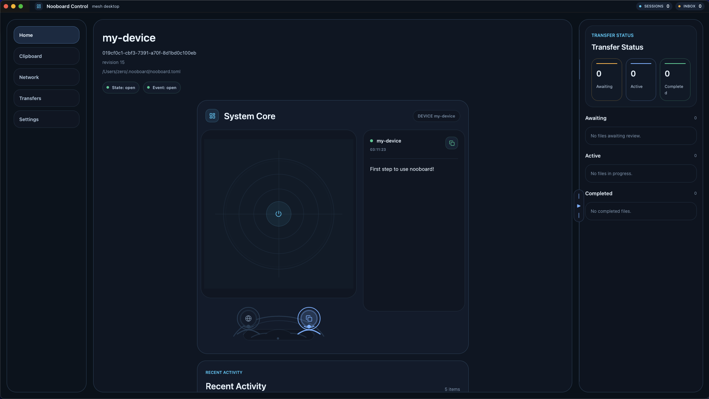
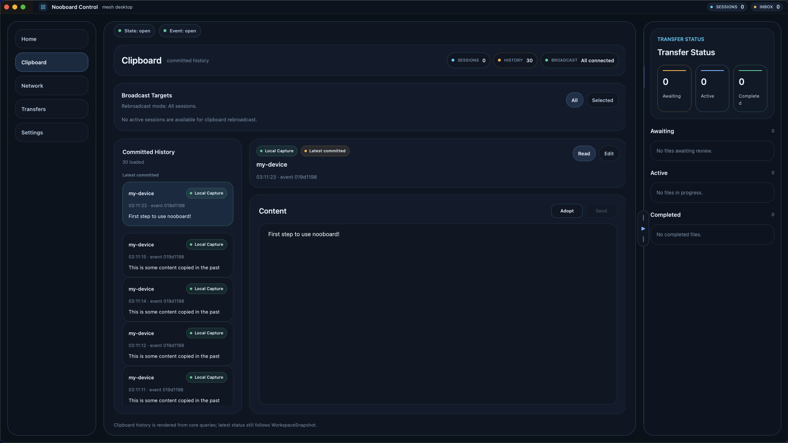
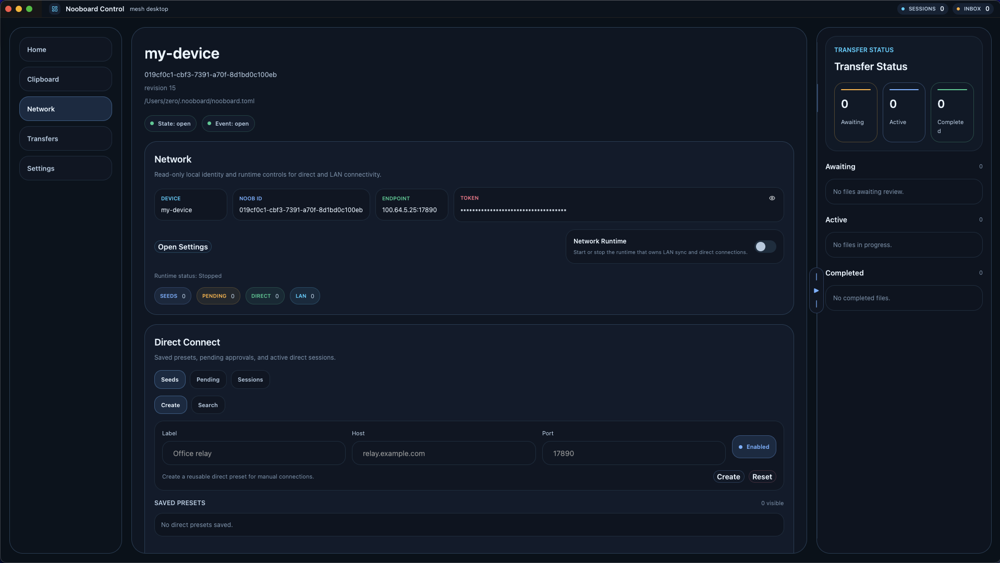
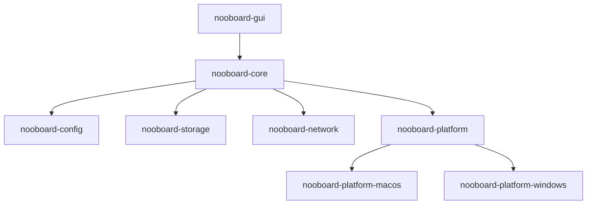

<h1>nooboard </h1>

`nooboard` is a tool to synchronize clipboard content and files across devices, built in Rust.

Built around a `nooboard-core` runtime and a GPUI frontend, `nooboard` currently includes:

- clipboard history, and support for reusing the content of past entries. (Tested, works well)
- peer discovery in local networks, and direct P2P sessions for clipboard sync. (Testing)
- file transfer workflows (Implemented, but not fully tested yet)

Today, `nooboard` targets macOS and Windows. Linux support is not planned for now, because I cannot imagine a Linux Desktop user, let alone a Linux Desktop user who will want to use `nooboard`. 

Transparency note: this project is developed with heavy AI assistance and supervised by a noob rustacean. The GPUI layer in particular is still validated more through working behavior and iteration than through complete source-level understanding.

## Screenshots

### Home

The home screen acts as a command center for your day-to-day flow, bringing clipboard activity, transfer status, and system signals into one focused view.



### History

The history view turns recent clipboard records into a reusable timeline, making it easier to recover valuable text, revisit past work, and rebroadcast entries when needed.



### Network

The network screen surfaces nearby peers, active sessions, and direct connection controls in one place, designed for a smoother cross-device workflow.



## Install

The latest macOS and Windows packages are published in the repository's Releases section on the GitHub project page.

- macOS: download the latest `.dmg`, open it, and drag `nooboard` into `Applications`
- Windows: download the latest installer from the same release

### macOS note

Current macOS releases are distributed without Apple notarization, so the first launch may be blocked by Gatekeeper.

1. Open `nooboard` once after moving it to `Applications`.
2. Open `System Settings` > `Privacy & Security`.
3. Scroll to the bottom of the page and approve `nooboard` with `Open Anyway`.
4. If macOS still blocks the app, right-click `nooboard` in `Applications` and choose `Open`.

## Build From Source

Requirements:

- Rust stable
- `cargo`

Run the GUI during development:

```bash
cargo run -p nooboard-gui
```

If the default config file does not exist yet, the app opens a bootstrap chooser and helps you create or select one.

Build a standalone release binary:

```bash
cargo build -p nooboard-gui --release
```

The GUI assets are embedded into the binary, so `target/release/nooboard-gui` can run without the source-tree `assets/` directory.

## Configuration

By default, `nooboard` looks for its config file here:

- macOS: `~/.nooboard/nooboard.toml`
- Windows: `%USERPROFILE%\.nooboard\nooboard.toml`

Launch with an explicit config file:

```bash
cargo run -p nooboard-gui -- --config /absolute/path/to/nooboard.toml
```

Force the chooser:

```bash
cargo run -p nooboard-gui -- --choose-config
```

## Release Packaging

Local packaging uses [`cargo-packager`](https://docs.rs/cargo-packager/latest/cargo_packager/):

```bash
cargo install cargo-packager --locked
```

Build macOS packages locally:

```bash
cd crates/nooboard-gui
cargo packager \
  --release \
  --formats app,dmg \
  --out-dir ../../target/release/bundle \
  --binaries-dir ../../target/release
```

Build Windows installers locally:

```bash
cd crates/nooboard-gui
cargo packager \
  --release \
  --formats nsis \
  --out-dir ../../target/release/bundle \
  --binaries-dir ../../target/release
```

Notes:

- Packaging is currently set up for macOS and Windows only.
- `cargo packager` runs `cargo build -p nooboard-gui --release` before bundling, so the packaging command is the main local entrypoint.

## Project Layout

### High-Level Call Graph



At a high level, the GUI talks to `nooboard-core`, and `nooboard-core` owns the integration points for configuration, storage, networking, and platform services. Platform-specific behavior is routed through `nooboard-platform` and then implemented by the macOS and Windows crates.

- `crates/nooboard-gui`: the GPUI frontend and packaged desktop app
- `crates/nooboard-core`: the main runtime and integration layer exposed to the GUI
- `crates/nooboard-config`: config schema, bootstrap resolution, template generation, and the config CLI
- `crates/nooboard-storage`: local persistence
- `crates/nooboard-network`: LAN/direct session runtime and transfer protocol
- `crates/nooboard-platform`: platform abstraction layer shared by the core runtime
- `crates/nooboard-platform-macos`: macOS-specific platform integration
- `crates/nooboard-platform-windows`: Windows-specific platform integration

## License

This project is licensed under the MIT License. See [`LICENSE`](./LICENSE).
